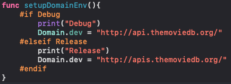

# MVVM Architecture Android: Template


This repository contains a sample app that implements MVVM architecture using Swift, ViewModel, Alamofire, and etc.


## The app has following packages:

1. **Model**: It simply holds the data and has nothing to do with any of the business logic. They’re usually structs or simple classes.
2. **ViewController**: The ViewController contains the View and owns the Model.
3. **ViewModel**: It acts as the bridge between the Model & View. The ViewModel will handle most if not all of the view’s display logic. ViewModels are usually classes, so they can be passed around as references.

4. **Network**: A class to handle the APIs requests.
5. **Constats**: Class contains all the constants used inside the project.
6. **Cell**: Views for the reusable cells.
7. **UnitTests**: samples for unit tests cases.


## Schemes:

The project contains two schemes:
1. **MVVM Template Dev**: For development environment.
2. **MVVM Template Prod**: For the production environment.

You can setup the URLs for each environment in the AppDelegate class:

<p align="center">

</p>

## Requirements

- Xcode 11.3+
- Swift 5.0+

## Installation

Before running the project you will need to enter these lines in your terminal
```
cd path_to_project
pod install
```

In case you don't have pod installed in your mac, please refer to this link:
https://medium.com/@soufianerafik/how-to-add-pods-to-an-xcode-project-2994aa2abbf1


### To generate classes from json response:
https://app.quicktype.io/


